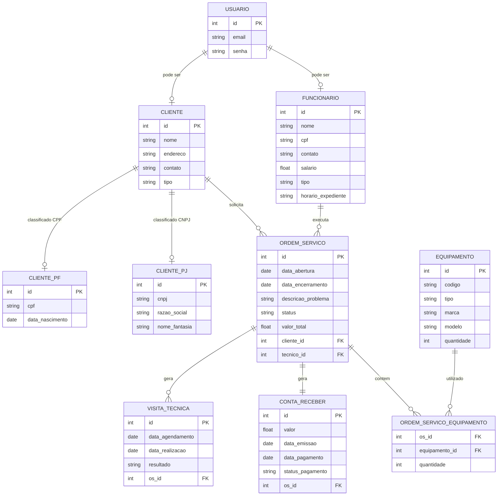

# Modelo de Dados

## 📊 Diagrama Entidade-Relacionamento (DER)

```mermaid
erDiagram
    USUARIO {
        int id PK
        string email
        string senha
    }
    
    CLIENTE {
        int id PK
        string nome
        string endereco
        string contato
        string tipo
    }
    
    CLIENTE_PF {
        int id PK
        string cpf
        date data_nascimento
    }
    
    CLIENTE_PJ {
        int id PK
        string cnpj
        string razao_social
        string nome_fantasia
    }
    
    FUNCIONARIO {
        int id PK
        string nome
        string cpf
        string contato
        float salario
        string tipo
        string horario_expediente
    }
    
    ORDEM_SERVICO {
        int id PK
        date data_abertura
        date data_encerramento
        string descricao_problema
        string status
        float valor_total
        int cliente_id FK
        int tecnico_id FK
    }
    
    EQUIPAMENTO {
        int id PK
        string codigo
        string tipo
        string marca
        string modelo
        int quantidade
    }
    
    VISITA_TECNICA {
        int id PK
        date data_agendamento
        date data_realizacao
        string resultado
        int os_id FK
    }
    
    CONTA_RECEBER {
        int id PK
        float valor
        date data_emissao
        date data_pagamento
        string status_pagamento
        int os_id FK
    }
    
    ORDEM_SERVICO_EQUIPAMENTO {
        int os_id FK
        int equipamento_id FK
        int quantidade
    }
    
    USUARIO ||--o| CLIENTE : "pode ser"
    USUARIO ||--o| FUNCIONARIO : "pode ser"
    CLIENTE ||--o| CLIENTE_PF : "classificado CPF"
    CLIENTE ||--o| CLIENTE_PJ : "classificado CNPJ"
    CLIENTE ||--o{ ORDEM_SERVICO : "solicita"
    FUNCIONARIO ||--o{ ORDEM_SERVICO : "executa"
    ORDEM_SERVICO ||--o{ VISITA_TECNICA : "gera"
    ORDEM_SERVICO ||--|| CONTA_RECEBER : "gera"
    ORDEM_SERVICO ||--o{ ORDEM_SERVICO_EQUIPAMENTO : "contem"
    EQUIPAMENTO ||--o{ ORDEM_SERVICO_EQUIPAMENTO : "utilizado"
```
